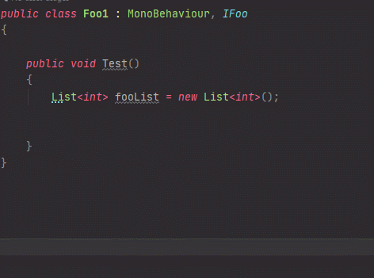

# 단축키

|기능|사용법|
|---|---|
|[탐색](#class-탐색)|Shift + Shift -> 클래스명 입력|
|[라인으로 가기](#class--line-탐색)| Shift + Shift -> 클래스명 {line} 입력|
|[함수로 가기](#Class--function-탐색) | Shift + Shift -> 클래스명 {function} 입력|
|[변수로 가기 (Property 포함)](#Class--variable-탐색) | Shift + Shift -> 클래스명.{variable} 입력|
|[그룹 드래그](#그룹-드래그)|Ctrl + W|
|[함수 단위 이동](#함수-단위-이동) |Alt + Up / Down|
|[파생 클래스 탐색](#파생-클래스-탐색) | Alt + End |
|[이동 메뉴](#이동-메뉴)| Ctrl + R, O|

# 편의기능
|기능|사용법|
|---|---|
|[var 만들기](#var)| .var + tab|
|[foreach 만들기](#foreach)| .foreach + tab|
|[for 만들기](#for)|.for + tab|
|[switch 만들기](#switch)|.switch + tab
|[if 만들기](#if)|.if + tab|
|[await 만들기](#await)| .await + tab|

# 단축키

# 탐색
## Shift + Shift
---

### Class 탐색
#### 클래스명

### Class + line 탐색
#### 클래스명 {line}

### Class + function 탐색
#### 클래스명 {function name}

### Class + variable 탐색
#### 클래스명.{variable name}

# 그룹 드래그
## Ctrl + W

# 함수 단위 이동
## Alt + Up / Down

# 파생 클래스 탐색
## Alt + End

# 이동 메뉴
## Ctrl + R, O

# 편의기능

## .var

## .foreach

## .for

## .switch

## .if

## .await

